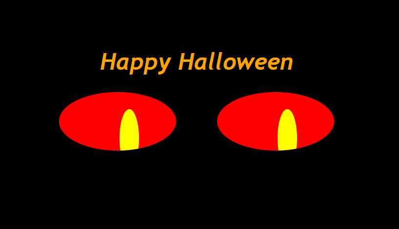

# Eyes
## Exercise on eyes for MIT xPro Professional Certificate in Coding: Full Stack Development with MERN

#### Description
This project displays a pair of eyes that will follow the movement of the mouse. This is accomplished using CSS and Javascript.

#### Future enhancements
Allow user to select colors of eyes and background

#### License information
This is under MIT license. See LICENSE for further information.
